# Predicting popularity of movies

AmazingPrimeVideo is a platform from streaming movies and tv shows online. Their team would like to develop an algorithm to predict which low budget movies being released will become popular so that they can buy the streaming rights. 
They have decided to sponsor a hackathon providing a clean dataset of movie data and asking participants to predict the popular pictures. 
We'll be working with them with using two documents, a json file from wikipedia with movies released since 1990, and rating data from Movie Land's website. We'll work to transform it into one clean data set and load the dataset into a SQL table. 

## Overview

To complete the task we'll be using pandas, re, numpy and json modules. Also we'll use SQL to query the tables created and confirm if they were created right.

First we have to import the files and inspect them. Since the Movie Land's information is on csv format, we can import them directly to dataframes but for the wikipedia information we have to load it into a csv since it's in json format. For this we create a function to load the files and return them as dataframes to being able to inspect.

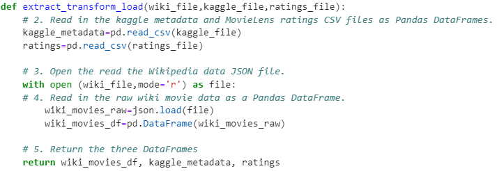

Once we have our dataframes ready to inspect, we proceed to work with them. 
The first one was the wikipedia dataframe. When this was inspected we noticed that:
* Columns had different names but contained the same type of information
* The dataframe contained not only movies but also tv series
* Duplicated rows
* Columns refered to currency were in the wrong format, having words or being on lists.
* Columns refered to date were in the wrong format, having words instead of datetime format.

The solutions implemented were:
* Create the function __change_column_name__ to change column names and to merge columns
* Create the function __clean_movie__ to create a single column for alternative titles and delete the extra columns.

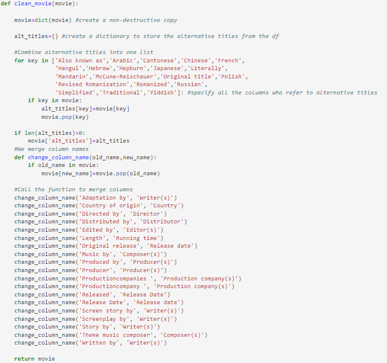

* Filter the dataframe in the __extract_transform_load__ function to only have movies
* Drop duplicates

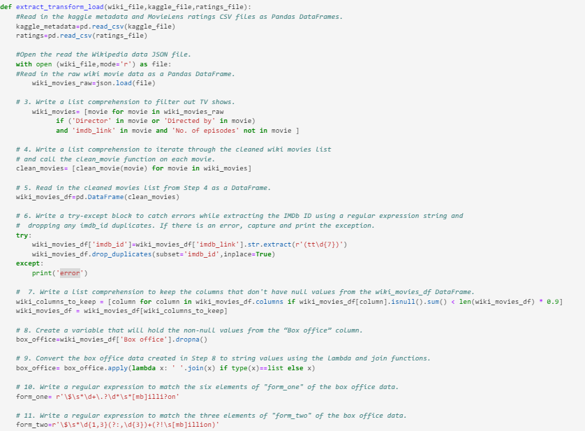

* Create the function __parse_dollars__ and with the help of regex we extracted only the necessary information

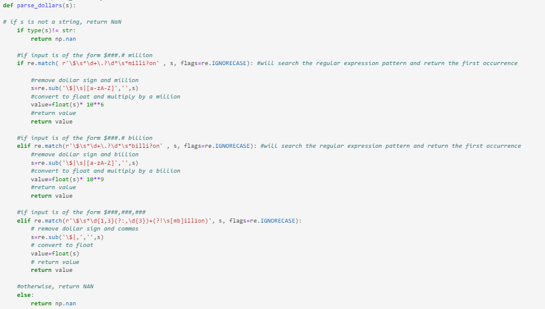

* Using lambda functions and regex convert the date formate into datetime format.

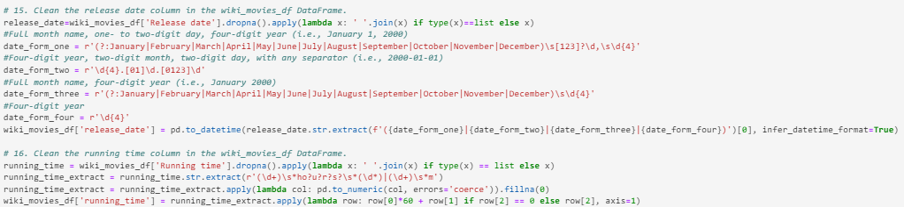

For the kaggle dataframe we had similar issues as the wikipedia, therefore we applied the same functions with an extra function that filled the missing data in the kaggle movies dataframe with information from the wikipedia movies dataframe.

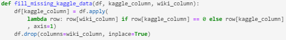

After this some columns were renamed and a final movie dataframe was created  with no missing values. Somo columns were renamed and merged.

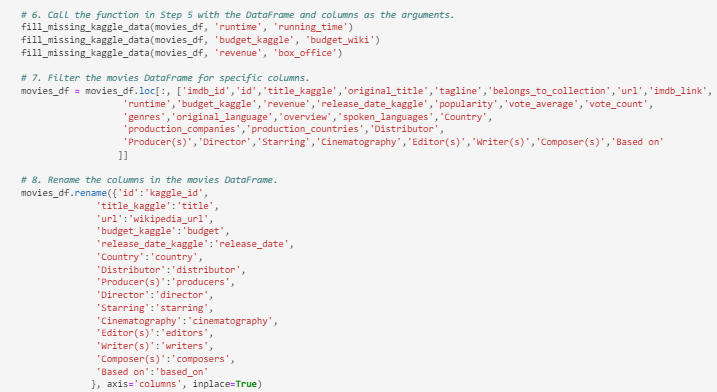

Finally the ratings information was cleaned and merged with the final movie dataframe.

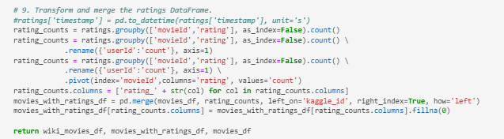

After cleaning the information, we create a connection with SQL to load the data into a table. 
Since the information is too large we will use 'chunksize' parameter from read_csv method to make it in blocks. 
To create the connection we use the module __from sqlalchemy import create_engine__ and __from config import db_password__ .

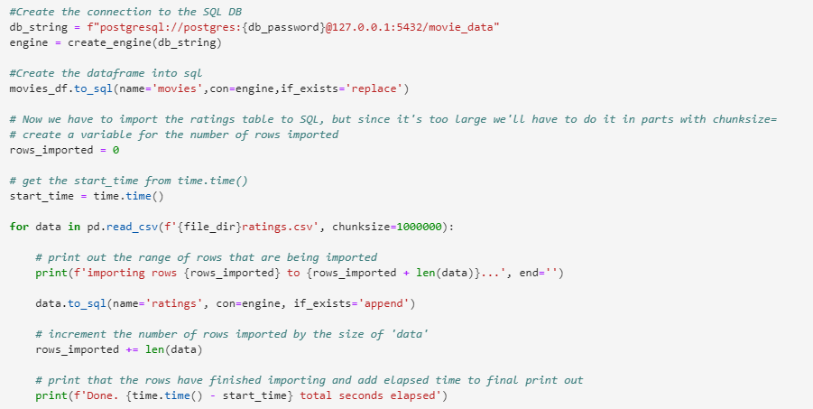

To check if the information was imported correctly into SQL we run queries to confirm the number of rows in the tables.

__Movie table__

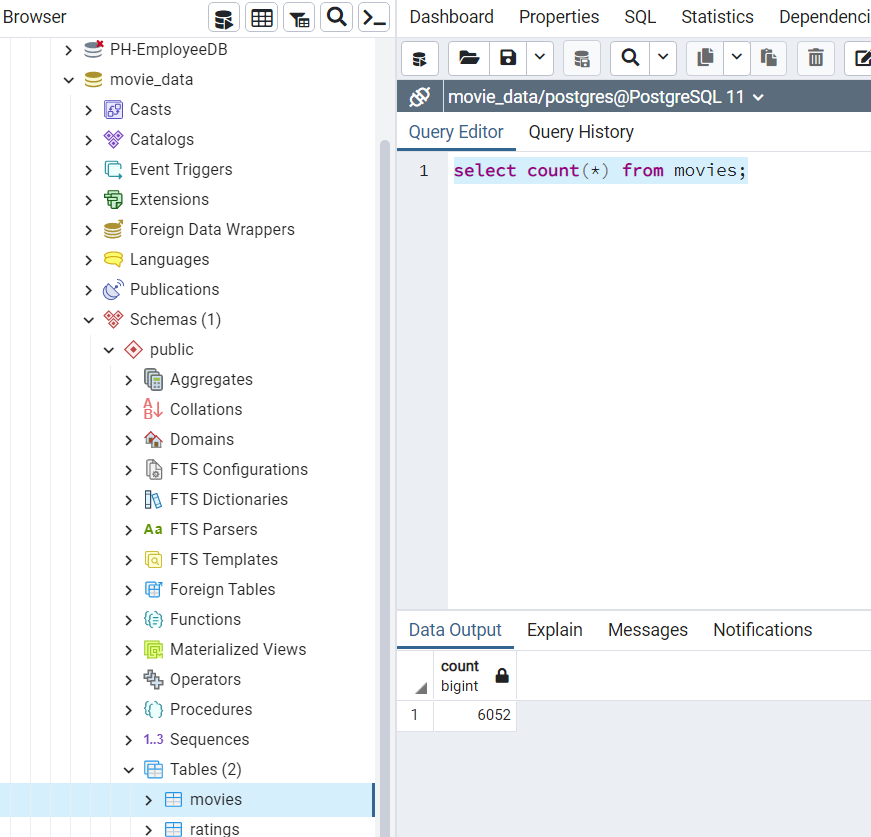

__Ratings table__

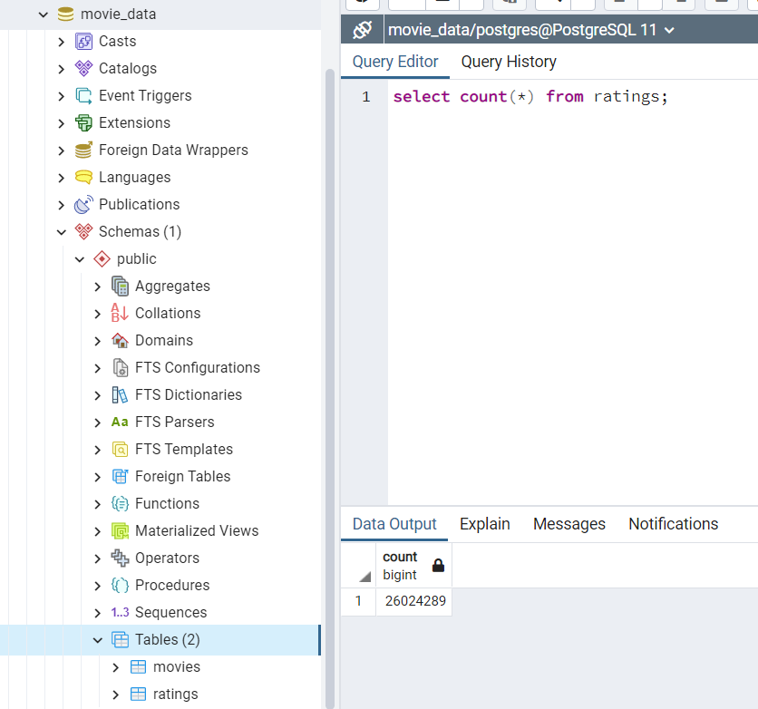